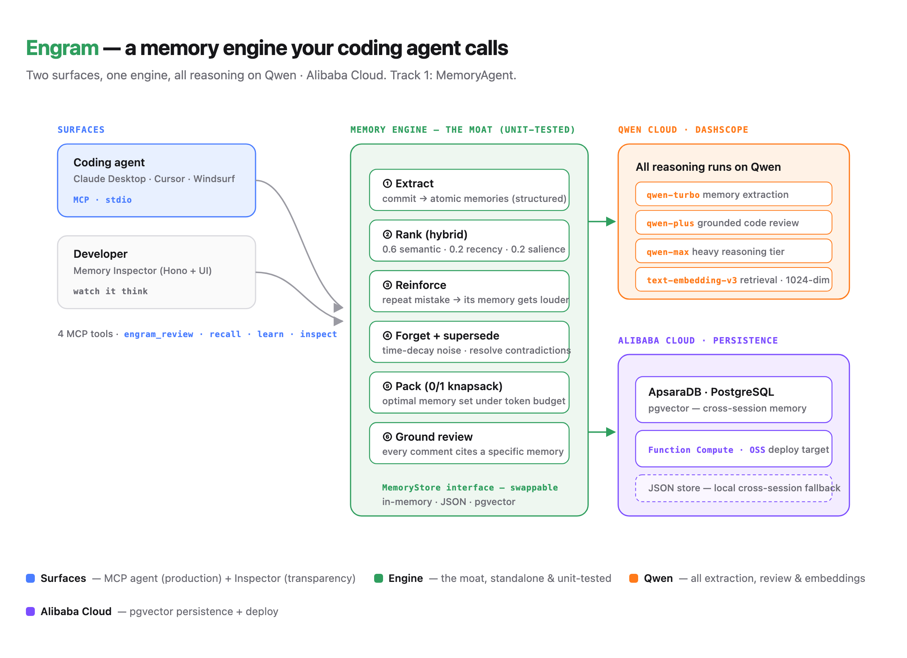

# 🧠 Engram — the code reviewer that remembers you

> A persistent **MemoryAgent** with a real, benchmarkable memory engine.
> Powered end-to-end by **Qwen** (DashScope / Model Studio) on **Alibaba Cloud**.
> Qwen Cloud Global AI Hackathon — **Track 1: MemoryAgent**.

> **🟢 Live on Alibaba Cloud: http://47.84.61.162** — the Memory Inspector,
> running on real Qwen (`backend=qwen`) from an Alibaba Cloud ECS instance in Singapore.

Linters know the language. Copilot forgets you the moment the session ends.
**Engram reads your git history and learns how _you_ code** — your style, your
tools, and the mistake you keep making — then catches it on your next diff,
*before it ships*.

> ### "I've seen this one. 4 times."
> That number is how many times you'd have shipped the *exact same bug*. Not a
> generic lint rule — your own mistake, remembered and thrown back at you before
> it ships.

Most "AI memory" is `topK(cosine)` over a vector store. Engram is a memory
**engine**: it extracts atomic memories from commits, ranks them with a hybrid
scoring function, **reinforces** recurring mistakes so they get louder,
**forgets** one-off noise via time-decay, **resolves contradictions** with an
audit trail, and **packs** the optimal memory set into a fixed token budget with
a 0/1 knapsack solver. Every decision is observable in a live Memory Inspector.

**The hero:** a bug you've made before makes its memory *louder* every time it
recurs. On a new diff, Engram catches it and tells you exactly how many times
you'd have shipped it — grounded in a specific memory of yours, not a generic
lint rule.

**Why it's not CodeRabbit (or a linter).** Tools like CodeRabbit learn from the
review comments you *write*; Engram learns from the mistakes you already *shipped*
and never commented on — mined straight from git history. And the class of bug it
targets is the hardest kind to catch: an **omission**. A missing `res.ok` check, an
empty `catch {}` — there's no bad token to grep for, it's the *absence* of a guard.
A linter can't flag what isn't there. Engram reinforces the missing-guard pattern
into one memory that gets louder each time you repeat it, then recognizes it on
your next diff — grounded in *your* history, not a rule someone else wrote.

---

## 📊 Benchmark — what forgetting actually buys

Reproducible harness (`npm run bench`) over a synthetic multi-session commit
history with planted facts, a later contradiction (Redux → Zustand), a style
flip (class → functional components), a decaying one-off (a Bun experiment), and
distractors. Embeddings are **live Qwen `text-embedding-v3` on Alibaba Cloud**;
the dataset is synthetic and controlled. **Four** context strategies, identical inputs:

| Config | Contradiction acc. | Stale-fact leakage | Avg tokens | Recall@5 |
|---|---|---|---|---|
| A — full-context stuffing | 50% | 100% | 446 | 100% |
| B — naive vector top-k *(status-blind)* | 50% | 100% | 67 | 100% |
| **B+ — top-k + forgetting** *(fair baseline)* | **100%** | **0%** | 69 | 100% |
| **C — Engram (hybrid + forgetting + knapsack)** | **100%** | **0%** | 69 | 100% |

**What this isolates.** Every config retrieves the right fact (Recall@5 100% —
trivial on a set this small), so recall isn't the story. The signal is the two
columns a *forgetting-blind* store can't touch: **contradiction accuracy** and
**stale-fact leakage**. The status-blind strategies (A full-context, B naive
top-k) re-inject superseded facts **100% of the time** and get contradictions
right only **half** the time. The moment a strategy *forgets* — drops
superseded/decayed memories — both snap to **100% / 0%**.

**We put a fair baseline in the ring — and it ties us.** B+ is naive top-k *plus*
forgetting (active-only), and nothing else: no hybrid recency/salience, no
knapsack. On this controlled set **B+ matches Engram exactly.** That's the honest
finding, and it's the point: on a handful of memories, **forgetting/supersession
is the differentiator — not the ranking or the packer.** A vector store that never
forgets leaks stale advice 100% of the time; add forgetting and that's fixed. What
Engram's hybrid rerank + 0/1-knapsack add shows up *at scale*, when memory counts
and token budgets actually bind — which you can watch happen live in the
**packing-causality panel** (a real knapsack, re-run per state, flips a keep/drop
decision) and on **a real 1,456-commit repo** below. We'd rather show you the fair
baseline than a strawman the engine was built to beat.

> Run it yourself: `npm run bench` runs **free** on the deterministic embedder
> (no coupon spend); add `--qwen` to run B/B+/C on live `text-embedding-v3`. The
> headline columns above are **identical on both** — recall is trivial on a set
> this small, and contradiction accuracy / stale leakage are driven by
> forgetting + supersession, not embedding quality (only latency differs: ~0ms
> mock vs ~0.3s live per probe). That's the point: the moat is the memory logic.

### Two real repos it had never seen — including the failure

The bench above is synthetic, so the fair objection is "you planted those
mistakes." We pointed Engram at two of our own repos it had never seen and
checked **every** claim against the actual code — and we're showing you the
failure, because fixing it is the point.

**First it failed honestly.** On `ravenote`, live Qwen extraction *invented* three
"recurring mistakes" — async/await null-checks, `var`, empty catches — none of
which exist anywhere in the repo (it has no `fetch`, no `await`, no `var`). Asked
"what mistakes does this dev make?", an LLM will confabulate plausible answers to
fill the schema. A memory that hallucinates is worse than no memory.

**So we moved mistake detection off the model.** Mistakes are now detected
**deterministically** from the real added code by a high-precision signature
registry and grounded: a mistake is learned only if its pattern is literally
present, and a review "catch" counts only if the pattern is in the diff. Qwen
still does the fuzzy work it's good at — style/tech/project extraction, the
review narration, embeddings. The result, re-verified against the code:

| Repo (unseen) | Before the fix | After — grounded | Truth |
|---|---|---|---|
| `ravenote` | 3 fabricated mistakes + 1 hallucinated catch | **0 mistakes** | no fetch/var/empty-catch exists — correct silence |
| `codehere` (1,456 commits) | — | **`var` ×3, empty-catch ×2** | real: `var onSpend=…`, `}catch(e){}` in the commits |

Same machinery: it catches the real recurring mistakes on `codehere` and **invents
nothing** on `ravenote`. And because detection is deterministic, you can reproduce
those numbers **offline for free** — no credits, no drift. Full writeups:
[`real-codehere.md`](bench/results/real-codehere.md) ·
[`real-ravenote.md`](bench/results/real-ravenote.md).

---

## ✨ What it does

- **Learns from commits** — Qwen structured-output extraction turns each commit
  (message + diff) into atomic `style ｜ tech ｜ project` memories. **Mistakes are
  detected deterministically** from the real added code by a high-precision
  signature registry (not proposed by the model), so a recurring mistake is
  grounded in code that actually exists — never confabulated. Nothing typed by hand.
- **Hybrid retrieval** — `score = semantic + recency + salience`; recency as
  half-life decay, salience time-decayed. The math is exposed per result.
- **Reinforcement (the hero)** — a repeated mistake reinforces the *same* memory
  (same `subject·predicate` slot / high cosine), so its salience climbs. The
  louder it gets, the harder it is to miss on your next diff.
- **Forgetting, on purpose** — continuous salience decay ages one-off noise (a
  tool you tried once) below a floor so it stops polluting advice.
- **Contradiction resolution** — a newer decision supersedes the old one in the
  same slot (Redux → Zustand), old memory kept with an audit trail.
- **Context packing** — a 0/1 knapsack selects the optimal memory set under a
  token budget; the Inspector shows what was packed, what dropped, and **why**.
- **Cross-session** — memories persist between runs (JSON store locally,
  ApsaraDB pgvector on Alibaba Cloud) so each session resumes instead of restarts.
- **Grounded review** — every review comment cites the specific memory it came
  from. Live retrieve → pack → ground is visible as the engine works.

## 🔌 Use it as an MCP server (the production surface)

Engram isn't a webpage you paste diffs into — the demo Inspector is just a window
into the engine. The way you actually *use* it is as an **MCP server**: a
long-term developer memory any MCP client (Claude Desktop, Cursor, Windsurf) can
call. It learns your recurring mistakes and grounds a review of your next diff in
a specific memory — memory that **forgets** one-off noise and gets **louder** on
repeated mistakes, unlike the general chat-memory MCP servers.

```bash
npm run mcp        # stdio MCP server (backend=mock; set ENGRAM_BACKEND=qwen for live)
```

Register it (Claude Desktop `claude_desktop_config.json` / Cursor MCP settings):

```json
{
  "mcpServers": {
    "engram": {
      "command": "npx",
      "args": ["tsx", "/ABSOLUTE/PATH/qwenhack/apps/mcp/server.ts"],
      "env": { "ENGRAM_BACKEND": "qwen", "DASHSCOPE_API_KEY": "sk-..." }
    }
  }
}
```

> Drop `env` entirely to run the server on the free deterministic mock. With
> `ENGRAM_BACKEND=qwen` but no key it won't crash — it logs a warning and falls
> back to mock, so the client always connects.

Tools it exposes:

| Tool | What it does |
|---|---|
| `engram_review` | Review a diff grounded in your memories; a warn cited to a *mistake* memory is a repeat bug caught before it ships (and reinforces that memory). |
| `engram_recall` | Recall the memories most relevant to a query/context, ranked by relevance · recency · salience. |
| `engram_learn` | Learn from a commit (message + diff) — extract, reinforce repeats, supersede contradictions. |
| `engram_inspect` | List active memories with salience + reinforcement counts. |

Memory persists via the store factory — JSON locally, ApsaraDB pgvector on
Alibaba Cloud — so it accumulates across sessions. Same engine as the benchmark
and the Inspector; this is just the surface an agent talks to.

## 🤖 How Qwen powers it (all reasoning)

| Job | Model (DashScope) |
|---|---|
| Memory extraction from diffs (per-commit, cheap) | `qwen-turbo` |
| Memory-grounded code review (the agent) | `qwen-plus` |
| Heavy reasoning tier | `qwen-max` |
| Embeddings for retrieval (1024-dim) | `text-embedding-v3` |

One client (`qwen-client.ts`) handles tiered routing, retries, timeouts,
JSON repair, and token accounting against the OpenAI-compatible DashScope
endpoint. `npm run proof` makes a live call and prints
`Qwen/DashScope OK · embed dims=1024`.

## 🏗️ Architecture



Two surfaces — the **MCP server** (the production surface any coding agent calls)
and the **Memory Inspector** (watch the engine think) — over one unit-tested
engine. All extraction, review, and embeddings run on **Qwen/DashScope**;
persistence is JSON (local / on the live ECS box) with **ApsaraDB pgvector** as the
managed option. Source for the diagram: [`docs/architecture.html`](docs/architecture.html).

## 🚀 How to run

```bash
npm install
npm test                    # 29 deterministic tests (scoring / packing / decay / reinforce)
npm run bench               # A/B/C benchmark — prints the table above

# Live Memory Inspector UI + API (the demo hero):
npm run dev                 # → http://127.0.0.1:5273

# Headless CLI — the whole engine from the terminal:
npm run engram learn         # learn a developer from planted git history
npm run engram inspect       # salience bars, reinforcement counts, audit trail
npm run engram review        # memory-grounded review of a fresh diff
npm run engram forget        # run the decay job; watch a one-off memory age out

# Go live on Qwen / Alibaba Cloud:
cp .env.example .env        # add DASHSCOPE_API_KEY + DASHSCOPE_BASE_URL
npm run hello               # live Qwen round-trip: chat + structured + embeddings
npm run engram review --qwen # same pipeline, live inference
npm run proof               # proof of the live Alibaba Cloud (Qwen/DashScope) call
```

> **Live Qwen is opt-in; mock is the free default.** Set `ENGRAM_BACKEND=qwen`
> (with `DASHSCOPE_API_KEY`) to run the demo/CLI on live Qwen; without it every
> command runs on a deterministic `MockMentorModel` behind the same `MentorModel`
> interface, so tests and CI are reproducible and free. The mock is labeled
> `backend: mock` in the UI — never presented as live intelligence. Mistake
> *detection* is deterministic in **both** backends (the signature registry), so
> the "never fabricates" property holds even offline.

## ✅ Status (honest)

- **LIVE on Alibaba Cloud** — Engram runs in production on an Alibaba Cloud **ECS**
  instance in Singapore at **http://47.84.61.162**, on `backend=qwen`. It's a
  persistent `systemd` service (auto-restart, survives reboot) with cross-session
  memory persisted to disk (JSON store). The whole engine — retrieve → pack →
  ground, the reinforced-mistake catch — runs there on real Qwen, not just on a
  laptop. The health check returns `{"ok":true,"backend":"qwen"}`.
- **Qwen on Alibaba Cloud is live and proven** — extraction, review, and
  embeddings all run on DashScope (`text-embedding-v3`, `qwen-turbo`, `qwen-plus`);
  `npm run proof` shows the round-trip.
- **Managed-infra path (Function Compute + OSS + ApsaraDB pgvector) is wired and
  documented** — `s.yaml`, `Dockerfile`, and the pgvector store adapter are in the
  repo as the serverless/scale alternative to the ECS deploy; set
  `MEMORY_STORE=postgres` to move persistence to ApsaraDB. No engine change needed.

## 🧩 Project layout

```
packages/memory-engine/     standalone, unit-tested engine (the moat)
  src/scoring.ts            pure hybrid ranking (tested to exact numbers)
  src/packing.ts            0/1 knapsack context packer (tested)
  src/decay.ts              forgetting + contradiction resolution (tested)
  src/engine.ts             write / retrieve / reinforce / pack / forget
  src/extract.ts            Qwen structured-output memory extraction
  src/model/qwen-client.ts  one client: retries, timeouts, JSON repair, tokens
  src/store/                MemoryStore interface · in-memory / JSON / pgvector
apps/api/server.ts          Hono API + static Memory Inspector (the demo hero)
apps/web/index.html         the Memory Inspector UI (self-contained)
apps/mcp/server.ts          MCP server — the production surface (agents call the engine)
cli/engram.ts                headless CLI (learn / review / forget / inspect)
bench/                      synthetic A/B/C harness + real-repo runner (from-repo.ts, real-run.ts)
alibaba/                    proof.ts + deploy config (s.yaml, Dockerfile)
```

## 🔧 Tech

TypeScript · Qwen via DashScope (OpenAI-compatible) · ApsaraDB for PostgreSQL
(pgvector) · Function Compute / OSS · Hono · self-contained HTML Inspector.

## 📄 License

MIT — see [LICENSE](./LICENSE).
